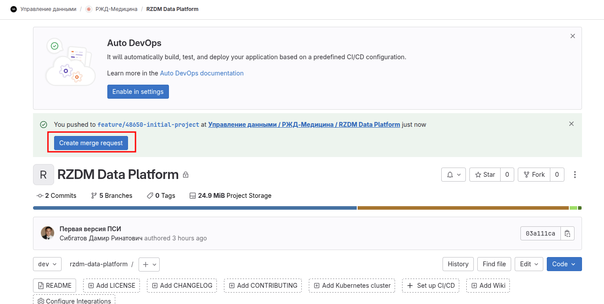
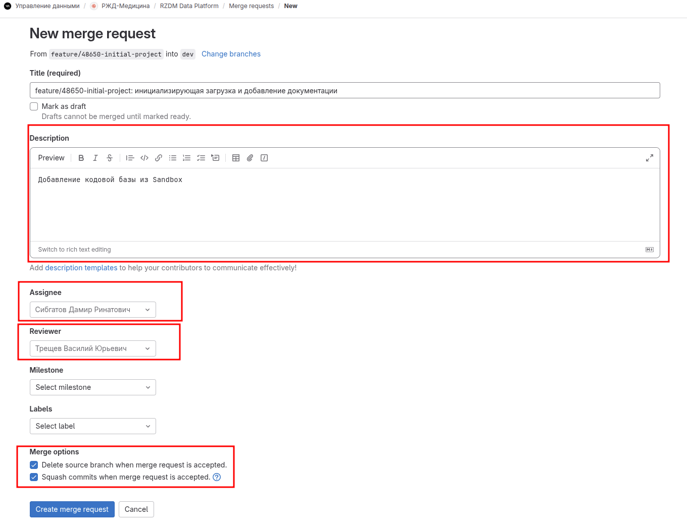
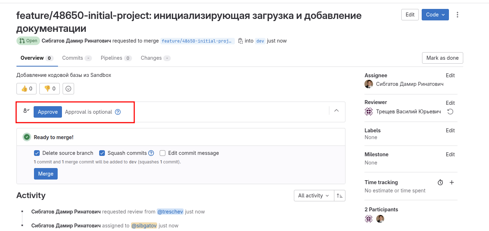
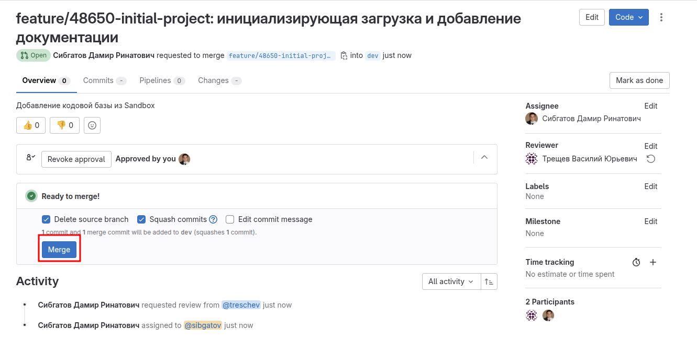
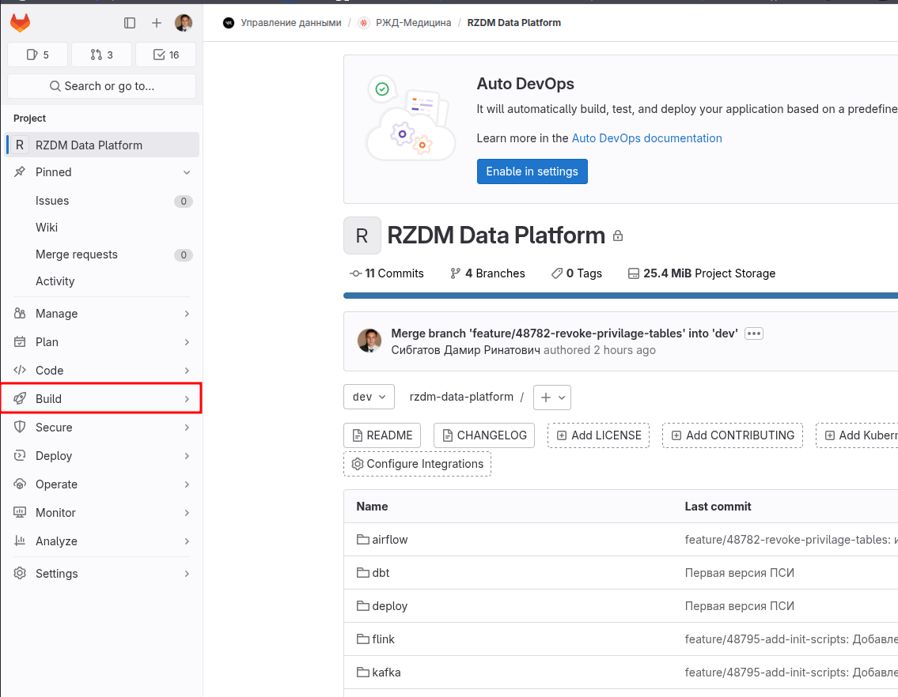
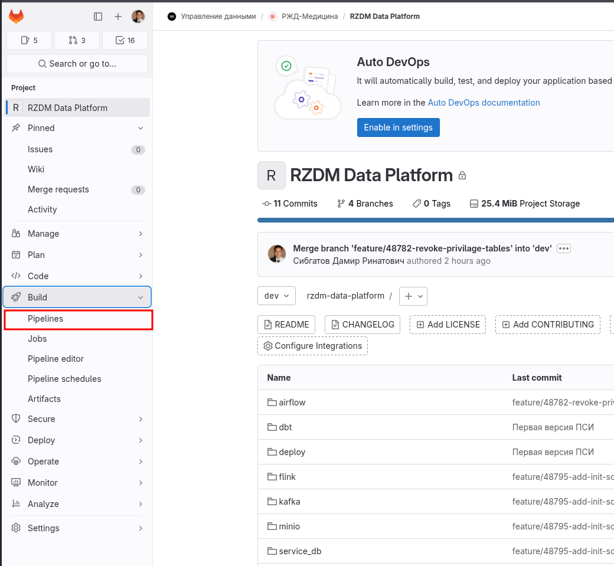
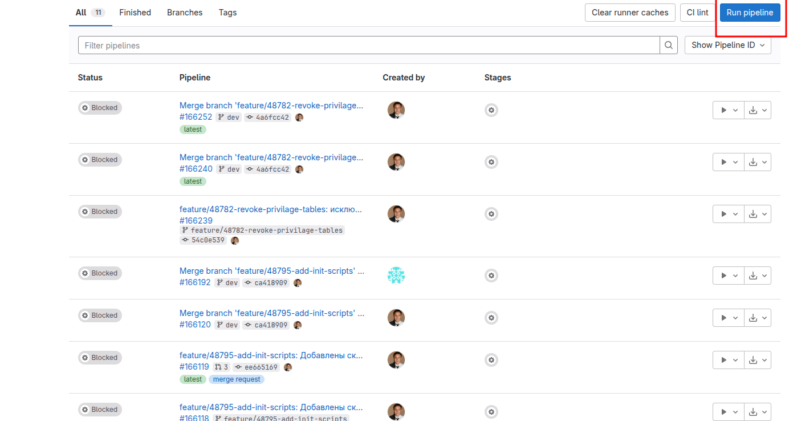
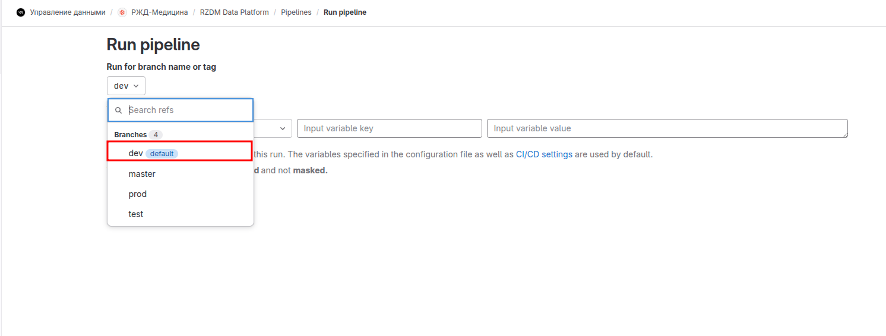
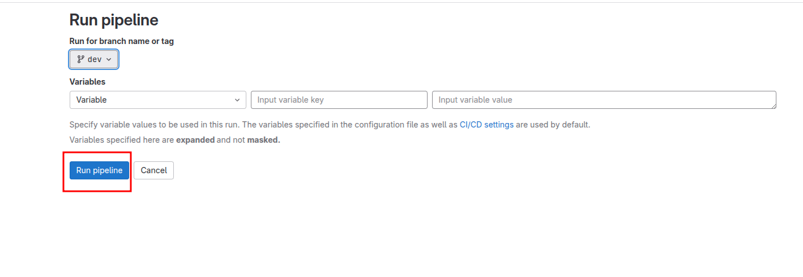
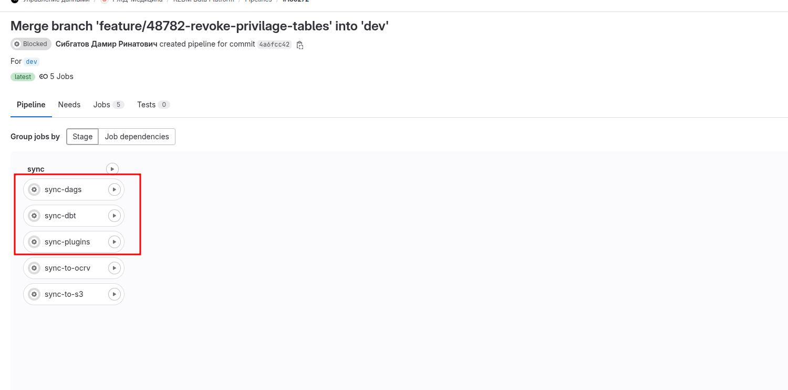

# Процесс разработки от создания ветки до деплоя

## Клонирование репозитория на локальный компьютер.

Необходимо выполнить одну из следующих команд:
```
git clone ssh://git@git.corp.myservices.digital:2222/dg/rzd-medicine/rzdm-data-platform.git
```
 
```
git clone https://git.corp.myservices.digital/dg/rzd-medicine/rzdm-data-platform.git
```
## Добавление записи в файл CHANGELOG.md

В файле CHANGELOG.md фиксируется номер релиза и внесенные в данные релиз изменения.
Информация о изменении включает в себя наименование трекера и номер выполняемой задачи.
Пример: **(User Story #48650) Перенесена кодовая база из проекта sandbox**


## Создание ветки

Формат наименование ветки: **<тип>/<идентификатор>-<краткое-описание>**

Разбор компонентов: 

1. Тип (prefix)

Указывают назначение изменений. Используйте следующие стандартные префиксы:

| Префикс    | Когда использовать                                                   |
|------------|----------------------------------------------------------------------|
| `feature/` | Новые функции, улучшения                                            |
| `bugfix/`  | Исправления багов                                                   |
| `hotfix/`  | Срочные исправления в проде                                         |
| `refactor/`| Изменения без изменения поведения (архитектура, читаемость)          |
| `docs/`    | Обновление документации                                             |
| `chore/`   | Техническое обслуживание (обновление зависимостей и т.п.)           |

2. Номер задачи

Пример: **48650**

3. Краткое описание

На английском (даже в русскоязычных командах) — это стандарт в разработке.
Используй kebab-case (minio-sensor, не MinioSensor и не minio_sensor).
Делай лаконично, но информативно:

✅ add-minio-sensor

❌ new-stuff

❌ fix

Пример комманд по созданию ветки:
```
git checkout dev
git pull
git checkout -b feature/48650-initial-project
```

## Далее вносим изменения в проект

**...**

## Осуществляем внесение изменений в созданную ветку

Добавляем файлы для отслеживания:
```
git add .
```

Осуществляем коммит. В коммит обязательно должно быть включено имя ветки:

```
git commit -m "feature/48650-initial-project: инициализирующая загрузка и добавление документации"
```

Отправляем изменения в Gitlab:
```
git push origin feature/48650-initial-project
```

После выполнения команды push в репозитории GitLab должен появиться запрос на создания merge request.



Далее необходимо заполнить все поля по примеру ниже.



После этого, когда ревьюер проверит ваш код, вы можете осуществить merge в ветку **dev**.





## Деплой

Для запуска деплоя переходим в Build -> Pipelines -> Run







Выбираем ветку для деплоя.





Выбираем, чтобы мы хотим синхронизировать:
- папку **dags**;
- папку **plugins**;
- папку **dbt**.

